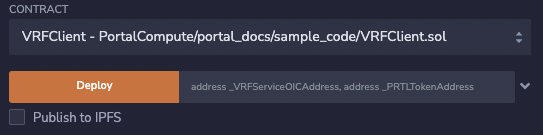

.. _developer_docs_vrf:

VRF Developer Docs
==================

Currently supported chains
--------------------------
.. csv-table:: TestnetVs
    :header: "Chain", "RPC Url", "chainId", "Currency", "Explorer", "Faucet"
    :widths: 100, 100, 100, 100, 100, 100

    "`Arbitrum Nitro Goerli Rollup <https://offchainlabs.com/>`_", "https://goerli-rollup.arbitrum.io/rpc", 421613, GoerliETH, "https://goerli-rollup-explorer.arbitrum.io", "https://goerlifaucet.com/"

    "`Optimism Goerli <https://www.optimism.io/>`_", "https://goerli.optimism.io", 420, "ETH", "https://goerli-optimism.etherscan.io/", "https://optimismfaucet.xyz/"

Requirements
------------
Get testnet ETH from one of the supported chains. Links to faucets are available above. 

`MetaMask <https://metamask.io/>`_ - to hold PRTL and testnet ETH and to sign off on transactions.

`Remix IDE <https://remix.ethereum.org/>`_ - to edit and deploy a VRFClient contract and easily interface with the testnet.

What is PRTL?
-------------
PRTL is an `ERC777 <https://eips.ethereum.org/EIPS/eip-777>`_ utility token based on `OpenZeppelin's implementation <https://docs.openzeppelin.com/contracts/4.x/erc777>`_ that is used to request oracle services.

.. code-block:: javascript

    pragma solidity ^0.8.0;

    import "https://github.com/OpenZeppelin/openzeppelin-contracts/blob/v4.0.0/contracts/token/ERC777/ERC777.sol";

    contract PRTLToken is ERC777 {
        constructor(uint256 initialSupply, address[] memory defaultOperators)
            ERC777("Portal Token", "PRTL", defaultOperators)
        {
            _mint(msg.sender, initialSupply, "", "");
        }
    }

Requesting an oracle service is as simple as sending PRTL an Oracle Interface Contract. To get tamperproof randomness via Portal's Verifiable Randomness Function (VRF) service, PRTL should be sent to the VRFServiceOIC contract. Below are the addresses of the PRTLToken and VRFServiceOIC contracts on our supported chains.

Deployed contract addresses
---------------------------
.. csv-table:: Testnet contract addresses
    :header: "Chain", "PRTLToken", "VRFServiceOIC"
    :widths: 100, 100, 100

    "Arbitrum Nitro Goerli Rollup", 0x2BfDD7e69a7D527D000B7A34290e67326E5fb113, 0x189d6a0D82b45efEF901Ea26bC384571f60E97f5 

    "Optimism Goerli", 0x83B4ad3f09087DEF9d8cFe069D56a1e79bB13006, 0x94a00834A8e147B5DA19B9748f1C2AA14488CC05

Getting PRTL
------------
You can obtain PRTL through Portal's web app `faucet <http://faucet.portalcompute.com>`_ or via Portal's API by sending a POST request to http://faucet.portalcompute.com/request. There is a daily limit of 100 PRTL per requester. You will need a faucet API key in order to authenticate your request. For this key, please contact us at support@portalcompute.com.

Both the API requires the following information:

- ``Network`` name (currently, the options are `arbitrum-nitro-goerli` and `optimism-goerli`)

- ``Address`` to send the PRTL to on the specified network.

- ``Faucet API Key``

An example API request is as follows:
``curl XPOST --network arbtrium-nitro-goerili --address 0x... --key ...``

Breaking down the contract
==========================

Explore on Remix IDE
--------------------
Give our VRF service a try `on Remix <https://remix.ethereum.org/#url=https://github.com/PortalCompute/portal_docs/blob/main/sample_code/VRFClient.sol>`_. The provided contracts are meant to familiarize developers with using Portal's VRF service and to serve as boilerplate code for integrating the service into new or existing Dapps.

VRFClientBase
-------------
.. code-block:: javascript

    import "https://github.com/OpenZeppelin/openzeppelin-contracts/blob/v4.0.0/contracts/utils/introspection/IERC1820Registry.sol";

    contract VRFClientBase {
        // Reference to the ERC1820 Registry contract available on all chains
        IERC1820Registry internal constant _ERC1820_REGISTRY =
            IERC1820Registry(0x1820a4B7618BdE71Dce8cdc73aAB6C95905faD24);

        constructor() {
            // Tell erc1820 registry that this contract can send PRTL 
            _ERC1820_REGISTRY.setInterfaceImplementer(
                address(this), // account
                keccak256("ERC777TokensSender"), // interfaceHash
                address(this) // implementer
            );
            // Tell erc1820 registry that this contract can receive PRTL 
            _ERC1820_REGISTRY.setInterfaceImplementer(
                address(this), // account
                keccak256("ERC777TokensRecipient"), // interfaceHash
                address(this) // implementer
            );
        }
        
        // The required interface so this contract can send PRTL
        function tokensToSend(
            address operator,
            address from,
            address to,
            uint256 amount,
            bytes calldata userData,
            bytes calldata operatorData
        ) external {
            // insert logic here to run before contract sends PRTL
        }

        // The required interface so this contract can receive PRTL
        function tokensReceived(
            address operator,
            address from,
            address to,
            uint256 amount,
            bytes calldata userData,
            bytes calldata operatorData
        ) external {
            // when tokens arrive at this contract…
        }
    }

This contract provides the required interfaces to send and receive ERC777 tokens. Contracts that implement `tokensToSend` and `tokensReceived` and register the interfaces on the `ERC1820 <https://eips.ethereum.org/EIPS/eip-1820>`_ registry contract are considered ERC777-aware, and can send and receive ERC777 tokens respectively. 

These steps prevent tokens from being locked in contracts with no means to removing them which is a pitfall of ERC20. Additionally, the `tokensToSend` and `tokensReceived` hook functions provide the Dapp developer with fine-grained control over token IO. For example, one could add logic to require that only the contract owner is allowed to send tokens in the `tokensToSend` function. 

VRFClient
---------
Getting randomness in a smart contract is difficult because blockchains are deterministic and intuitive sources like the blockhash can be manipulated by miners and validators. Therefore, it is important to use a tamperproof source of randomness when there are economic consequences (e.g., when running lotteries or minting NFTs). 

The ``VRFClient`` contract provides a simple dice-rolling application that can easily be extended depending on the use case. The randomness for the ``diceRoll`` is generated off-chain by a Portal node running a verifiable random function inside of a secure enclave. By default, the verification logic is run off-chain in the enclave after the randomness is produced. Users can optionally verify the randomness on-chain, but this incurs extra gas costs. 

.. code-block:: javascript

    contract VRFClient is VRFClientBase {
        address owner;
        uint256 public diceRoll;
        uint256 constant NUM_SIDES = 6;
        event DiceRolled(bytes32 _randomness, uint256 _diceRoll);

        // Hardcoded addresses of the VRFServiceOIC and PRTLToken
        address VRFServiceOICAddress = 0x189d6a0D82b45efEF901Ea26bC384571f60E97f5;
        PRTLToken PRTL = PRTLToken(0x2BfDD7e69a7D527D000B7A34290e67326E5fb113);

        constructor() VRFClientBase() {
            owner = msg.sender;
        }

        // This function makes a VRF request to the VRFServiceOIC contract.
        // The contract's PRTL is locked in the VRFServiceOIC until the VRF
        // request is fulfilled, at which point any excess PRTL is refunded. 
        // @ _workerId: the id of the worker enclave that will fulfill the request
        // @ _fullVerify: if true will run verification on-chain (~2M gas), else 
        // accepts the result as is since verification was run by the node off-chain.
        function requestVRF(uint32 _workerId, bool _fullVerify) external onlyOwner {
            // The amount of PRTL to lock as part of this VRF request
            uint256 _prtlAmount = 5000000000000000000; // 5 PRTL
            require(PRTL.balanceOf(address(this)) >= _prtlAmount, "Contract has insufficient PRTL!");
            
            // max amount of gas allocated to callback function - remaining gas is refunded as PRTL
            uint32 _maxCallbackGas = 200000;
            
            // address of the contract with the 'rawFulfillVRF(bytes32)' callback function
            address _callbackAddr = address(this);

            // Encode the parameters as bytes which are forwarded with the PRTL
            bytes memory payload = abi.encode(_workerId, _maxCallbackGas, _callbackAddr, _fullVerify);

            // Send PRTL to the OIC contract to be locked and initiate the VRF request
            PRTL.send(VRFServiceOICAddress, _prtlAmount, payload);
        }

        // The function the VRFServiceOIC will call to fulfill the request
        function rawFulfillVRF(bytes32 _randomness) external {
            require(msg.sender == VRFServiceOICAddress, "Only Enclave can fulfill");
            // call the user defined callback()
            fulfillVRF(_randomness);
        }

        // This is the user's callback function. Only the specified VRFServiceOIC contract 
        // can call this function. Any logic to consume the _randomness is implemented here:
        function fulfillVRF(bytes32 _randomness) internal {
            // random dice roll between [1,NUM_SIDES]
            diceRoll = (uint256(_randomness) % NUM_SIDES) + 1;

            // Perform some action using result
            // - mint nft
            // - run lottery
            // - game action
            // ...  

            // Emit an event to notify a frontend
            emit DiceRolled(_randomness, diceRoll);
        }

        modifier onlyOwner() {
            require(msg.sender == owner);
            _;
        }
    }

VRF requests are made when the ``VRFClient`` contract's owner executes the ``requestVRF`` function. This function will lock PRTL in the ``VRFServiceOIC`` contract and notify an off-chain node to perform the VRF computation in their worker enclave. Upon completing the computation, the node forwards an enclave-signed transaction that contains the requested randomness to the ``VRFServiceOIC``. This contract then executes the ``rawFulfillVRF`` function at the ``_callbackAddr`` contract address which in turn will execute the client-defined ``fulfillVRF`` function that contains the business logic to use the randomness (e.g., roll dice). 

The main requirements are that the ``VRFClient`` contract holds enough PRTL tokens to issue a request and that the ``rawFulfillVRF`` and ``fulfillVRF`` functions are implemented. For convenience in this demo, multiple values are hardcoded:

- ``uint32 _workerId``: The identifier of a registered worker enclave in the ``VRFServiceOIC``. This worker enclave is hosted by a node and will execute the VRF computation. 

- ``bool _fullVerify``: When ``true`` the fulfilled randomness will be verified on-chain to ensure it was correctly computed from the ``hash(blockhash || workerId || requestId)``. When ``false``, the on-chain verification is skipped, saving ~20x the gas. Since verification was already run off-chain in the worker enclave, it is sufficient to simply check that the fulfillment transaction came from the expected enclave worker.

- ``uint256 _prtlAmount``: The amount of PRTL to lock as part of the VRF request, where 1 PRTL == 10^18. Note that excess PRTL will be refunded back to the `VRFClient` contract upon the fulfillment of the request. In this example, we hardcode locking 5 PRTL to ensure enough PRTL is sent for on-chain verification. 

- ``uint32 _maxCallbackGas``: The amount of gas to supply the client-defined callback function ``fulfillVRF``. Any remaining gas is refunded to the client in PRTL.

- ``address _callbackAddr``: The address of the contract containing the client-defined callback function. In this demo, this is simply the ``VRFClient`` contract address.

- ``bytes memory payload``: The abi-encoded bytes to include when sending PRTL to the ``VRFServiceOIC``. This is computed via ``abi.encode(_workerId, _maxCallbackGas, _callbackAddr, _fullVerify)`` and allows us to pay for the request and specify the parameters in a single transaction.

Deploy a VRFClient contract
---------------------------
The following documents how to deploy a ``VRFClient`` contract in the Remix environment.

.. |initial_diceroll| image:: ../images/initial_diceroll.png

.. csv-table::  
    :width: 100%

    "Open the `VRFClient contract in Remix <https://remix.ethereum.org/#url=https://github.com/PortalCompute/portal_docs/blob/main/sample_code/VRFClient.sol>`_.",  
    "| Navigate to the `SOLIDITY COMPILER` tab 
    | and click `Compile VRFClient.sol`.", |pre_click_compile|
    "| After compilation, the dropdown menu. 
    | with publishing options will be visible.", |post_click_compile|
    "| Ensure MetaMask has the desired test network
    | set. In this demo we use Arbitrum Nitro.", |network_select|
    "| Navigate to the `DEPLOY & RUN TRANSACTIONS`
    | tab and select `Injected Provider - Metamask` 
    | under the `ENVIRONMENT` dropdown. (You will
    | have to allow Remix to interact with MetaMask).", |deploy_env| 
    "| Select the ``VRFClient`` contract and click `Deploy.`", |pre_click_deploy|
    "| MetaMask will ask you to confirm the
    | transaction to deploy the ``VRFClient`` contract.  ", |deploy_confirmation|
    "| The deployed ``VRFClient`` contract will be
    | available under the `Deployed Contracts` section.
    | 
    | Click the `Copy` icon to copy the contract 
    | address to your clipboard.", |copy_deployed_address|
    "| Clicking `diceRoll` should return the
    | default value ``0``.", |initial_diceroll|

Send PRTL to the VRFClient contract
-----------------------------------

In order for the ``VRFClient`` contract to make VRF requests, it needs PRTL. The following documents how to transfer PRTL to the ``VRFClient`` contract. See section :ref:`Getting PRTL` to learn how to get PRTL into your wallet.

.. csv-table::  

    "| Select the PRTL token from the `Assets` tab.", |assets|
    "| Click `Send`.", |view_send_prtl|
    "| Paste the deployed ``VRFClient`` contract
    | address, enter a PRTL amount, and 
    | click `Next`.", |click_send_prtl|
    "| Click `Confirm` to approve the transaction.", |confirm_send_prtl|
    "| Verify the PRTL was sent.", |send_prtl_confirmation|

Interacting with the VRFClient contract
---------------------------------------
At this point, the ``VRFClient`` contract should be deployed to the desired testnet and is supplied with PRTL tokens. The following documents how to make VRF requests from Remix.

.. csv-table::  

    "| Return to the `Deployed Contracts` section. Enter
    | values for ``_workerId`` and ``_fullVerify``. For this
    | demo we choose ``0`` and ``true`` respectively to 
    | select worker 0 and do on-chain verification. 
    | 
    | Click `requestVRF` to issue the request.", |pre_request|
    "| MetaMask will ask you to confirm the
    | transaction.", |confirm_request|
    "| Verify that the transaction was sent at
    | the bottom of the IDE.", |request_confirmation|
    "| The Node's enclave worker will process the
    | request and post the fulfillment transaction
    | back on-chain. The time to respond despends on the 
    | congestion of the testnet and availability of 
    | nodes, but will likely take < 1 minute.
    | 
    | After receiving the response, clicking `diceRoll` 
    | will display the randomness result mapped to a 
    | value from one to six.", |final_diceroll|
 

Integrating with your own Dapp
------------------------------
The ``fulfillVRF`` callback function is where the ``bytes32 _randomness`` is consumed and is where custom Dapp-specific actions are defined. The sample code simply maps the randomness to a number from one to six and logs an event, but any logic from minting an NFT to running a chance-based game can be implemented here.

.. code-block:: javascript

    // This is the user's callback function. Only the specified VRFServiceOIC contract 
    // can call this function. Any logic to consume the _randomness is implemented here:
    function fulfillVRF(bytes32 _randomness) internal {
        // random dice roll between [1,NUM_SIDES]
        diceRoll = (uint256(_randomness) % NUM_SIDES) + 1;

        // Perform some action using result
        // - mint nft
        // - run lottery
        // - game action
        // ...  

        // Emit an event to notify a frontend
        emit DiceRolled(_randomness, diceRoll);
    }

